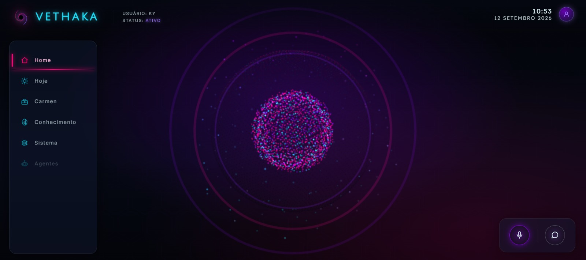
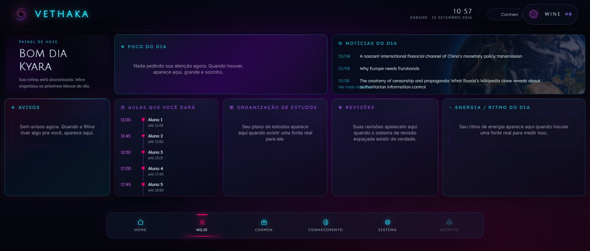
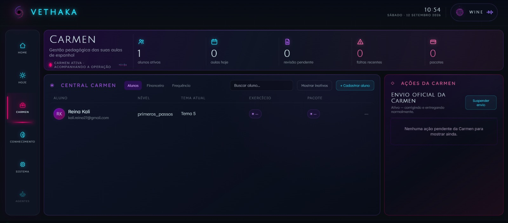
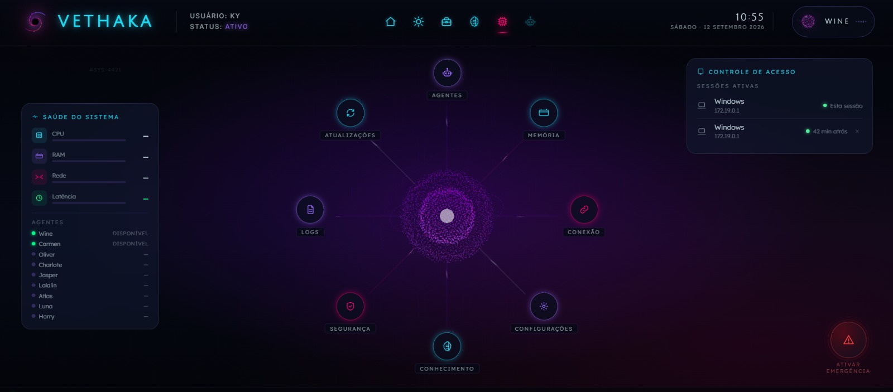

<div align="center">

# VETHAKA

### Plataforma pessoal com inteligência artificial e arquitetura multiagente


</div>

---

## Sobre o Projeto

O **Vethaka** é uma plataforma pessoal com inteligência artificial criada para reunir diferentes agentes especializados em um único ambiente.

A proposta surgiu da minha própria necessidade de centralizar atividades que normalmente estariam distribuídas entre diferentes ferramentas: organização, estudos, ensino, acompanhamento de informações, automações e interação com inteligência artificial.

Em vez de utilizar uma única IA para todas as tarefas, o Vethaka é estruturado como um **ecossistema de agentes**, em que cada agente possui uma área de responsabilidade específica.

O projeto está em desenvolvimento contínuo e funciona também como ambiente de experimentação prática de **desenvolvimento de software, inteligência artificial, automação, integração de APIs e experiência do usuário**.

---
---

## Interface do Vethaka

A interface do Vethaka foi projetada para centralizar os diferentes agentes e funcionalidades do sistema em um único ambiente.

### Home



A tela inicial concentra a visão geral do sistema e o acesso aos principais módulos.

### Hoje



A área **Hoje** organiza informações e atividades relevantes para o momento atual.

### Carmen



A **Carmen** é o módulo voltado à gestão das atividades relacionadas ao ensino de espanhol, incluindo alunos, frequência e pagamentos.

### Visão do sistema



Esta tela apresenta uma visão mais ampla da interface e da organização dos módulos do Vethaka.

---

## Visão Geral da Arquitetura

```text
                         USUÁRIO
                            │
                            ▼
                    INTERFACE VETHAKA
                            │
                            ▼
                           WINE
                    Agente coordenadora
                            │
              ┌─────────────┼─────────────┐
              ▼             ▼             ▼
           CARMEN          ATLAS          LUNA
          Ensino e        Notícias      Observação
           alunos         e estudo       do sistema
              │             │             │
              └─────────────┼─────────────┘
                            ▼
                  BACKEND + SERVIÇOS
                            │
               ┌────────────┼────────────┐
               ▼            ▼            ▼
             Banco         APIs      Modelos de IA
             de dados     externas
```

A arquitetura foi pensada para permitir que novos agentes sejam incorporados ao sistema sem transformar todas as funções em um único módulo central.

---

## Agentes

### Wine — Coordenação

A **Wine** é a principal interface entre o usuário e o Vethaka.

Ela funciona como agente coordenadora, interpretando solicitações e direcionando ações para os módulos adequados.

Entre as funcionalidades desenvolvidas estão:

- interação por voz;
- interpretação de solicitações;
- navegação pelo sistema através de comandos;
- acionamento de funcionalidades internas;
- recuperação de contexto;
- comunicação com outros módulos do Vethaka.

---

### Carmen — Ensino de Espanhol

A **Carmen** é o agente especializado na gestão das atividades relacionadas ao ensino de espanhol.

O módulo atualmente permite:

- cadastro de alunos;
- gerenciamento de informações dos alunos;
- registro de frequência;
- acompanhamento de pagamentos;
- organização de atividades acadêmicas.

O módulo continua em desenvolvimento, incluindo automações relacionadas ao fluxo de aulas e integrações externas.

---

### Atlas — Notícias e Informação

O **Atlas** é o agente voltado à coleta, organização e acompanhamento de notícias e informações relevantes.

Sua arquitetura está sendo desenvolvida para apoiar:

- acompanhamento de notícias;
- organização de temas;
- fichamento de informações;
- classificação de conteúdos;
- apoio aos estudos;
- consulta posterior de informações relevantes.

---

### Luna — Observação

A **Luna** funciona como um módulo de observação do Vethaka.

Sua proposta é acompanhar informações produzidas pelo próprio sistema e transformá-las em uma visualização mais clara da utilização, evolução e comportamento das atividades.

O foco do agente está em:

- observação de padrões;
- acompanhamento de atividades;
- consolidação de informações;
- geração de visualizações;
- redução da necessidade de análise manual de dados.

---

### Outros agentes

A arquitetura do Vethaka prevê agentes especializados em outras áreas, como:

- estudos;
- revisão espaçada;
- escrita;
- idiomas;
- preparação acadêmica;
- organização de conhecimento.

Nem todos esses módulos estão concluídos ou disponíveis na versão atual.

---

## Funcionalidades atuais

Algumas das funcionalidades já desenvolvidas e testadas no projeto incluem:

| Área | Funcionalidade |
|---|---|
| Interface | Interface web centralizada |
| IA | Integração com modelos generativos |
| Arquitetura | Estrutura baseada em agentes especializados |
| Voz | Interação com a Wine por voz |
| Voz | Navegação através de comandos falados |
| Carmen | Cadastro de alunos |
| Carmen | Registro de frequência |
| Carmen | Controle de pagamentos |
| Backend | Comunicação entre frontend e backend |
| Integrações | Comunicação com serviços externos |
| Contexto | Recuperação e utilização de informações relevantes |
| Infraestrutura | Execução através de containers |
| Qualidade | Testes funcionais e validação de regressões |

---

## Tecnologias

O Vethaka utiliza diferentes tecnologias de acordo com as necessidades de cada módulo.

### Backend


- Python
- FastAPI
- APIs REST
- WebSocket

### Frontend


- React
- TypeScript
- interface web responsiva

### Infraestrutura


- Docker
- VPS
- banco de dados
- serviços independentes

### Inteligência Artificial

- modelos generativos;
- arquitetura multiagente;
- processamento de contexto;
- integração de voz;
- chamadas de ferramentas;
- automação assistida por IA.

### Integrações

- Google APIs;
- serviços externos;
- APIs de terceiros;
- sistemas de inteligência artificial.

---

## Processo de Desenvolvimento

O Vethaka é desenvolvido de forma incremental.

O fluxo utilizado normalmente segue estas etapas:

```text
IDEIA
  ↓
DEFINIÇÃO DO PROBLEMA
  ↓
REQUISITOS
  ↓
PLANEJAMENTO
  ↓
IMPLEMENTAÇÃO ASSISTIDA POR IA
  ↓
TESTES
  ↓
AUDITORIA
  ↓
CORREÇÃO
  ↓
NOVOS TESTES
  ↓
VALIDAÇÃO
  ↓
INTEGRAÇÃO
```

Esse processo foi adotado principalmente para permitir que um sistema grande seja desenvolvido em blocos menores e verificáveis, reduzindo regressões entre diferentes módulos.

---

## Desenvolvimento assistido por Inteligência Artificial

A inteligência artificial não é apenas uma funcionalidade do Vethaka: ela também faz parte do próprio processo utilizado para desenvolver o projeto.

A implementação de código é realizada com apoio de ferramentas de programação baseadas em IA, incluindo **ChatGPT e coding agents** como Codex e Claude Code.

Essas ferramentas são utilizadas para atividades como:

- implementação de funcionalidades;
- geração e revisão de código;
- investigação de bugs;
- criação de testes;
- análise técnica;
- documentação;
- auditoria de implementações.

Minha atuação no projeto envolve:

- concepção do produto;
- identificação dos problemas que o sistema deve resolver;
- definição dos agentes;
- definição das responsabilidades de cada módulo;
- levantamento de requisitos;
- planejamento de funcionalidades;
- decisões de arquitetura funcional;
- planejamento de interface e experiência;
- elaboração dos fluxos de interação;
- direcionamento dos agentes de programação;
- execução de testes reais;
- identificação de falhas;
- análise dos resultados;
- definição de critérios de aprovação;
- priorização de correções;
- validação das implementações.

O desenvolvimento, portanto, utiliza IA como ferramenta de implementação e colaboração técnica, enquanto as decisões sobre **produto, comportamento, requisitos, testes e evolução do sistema** são conduzidas por mim.

---

## Alguns desafios trabalhados

Durante o desenvolvimento do Vethaka, diferentes problemas técnicos precisaram ser investigados e iterados.

Entre eles:

- coordenação entre múltiplos agentes;
- gerenciamento de contexto;
- comunicação entre frontend e backend;
- integração de voz em tempo real;
- redução de latência;
- detecção de fala;
- navegação por voz;
- integração com serviços externos;
- persistência de dados;
- funcionamento de sistemas não determinísticos;
- prevenção de regressões;
- testes em ambientes local e de produção;
- modularização de um sistema em crescimento.

---

## Demonstração

Uma demonstração do Vethaka será disponibilizada neste repositório.

O vídeo apresentará funcionalidades reais da versão atual do projeto, incluindo:

- interface principal;
- interação com a Wine;
- comandos por voz;
- navegação;
- módulo Carmen;
- cadastro e gerenciamento de alunos;
- frequência;
- pagamentos.

> O Vethaka ainda está em desenvolvimento. A demonstração representa o estado atual do sistema e não um produto finalizado.

---

## Status do Projeto


O Vethaka está em desenvolvimento contínuo.

Alguns módulos já possuem funcionalidades utilizáveis, enquanto outros continuam em construção, integração ou validação.

O desenvolvimento acontece de forma incremental: uma funcionalidade é integrada ao sistema principal somente após passar pelos testes definidos para aquele estágio.

---

## Código-fonte

O código-fonte principal do Vethaka está armazenado em um **repositório privado**.

Este repositório público foi criado especificamente para:

- apresentar o projeto;
- documentar sua proposta;
- demonstrar sua arquitetura;
- registrar tecnologias utilizadas;
- apresentar funcionalidades;
- disponibilizar demonstrações do sistema.

O objetivo não é distribuir o código-fonte do Vethaka.

---

## Objetivos de Aprendizado

O projeto permite aplicar na prática conhecimentos relacionados a:

- desenvolvimento de sistemas;
- frontend e backend;
- APIs;
- bancos de dados;
- Docker;
- inteligência artificial;
- agentes de IA;
- automação;
- arquitetura de software;
- testes;
- integração de serviços;
- UX;
- engenharia de requisitos;
- gerenciamento de projetos técnicos.

---

## Autora

**Kyara**

Estudante de **Técnico em Desenvolvimento de Sistemas**.

O Vethaka é um projeto pessoal criado para transformar necessidades reais em um sistema funcional enquanto aplico e desenvolvo conhecimentos técnicos na prática.

---

<div align="center">

**VETHAKA**

*Um sistema, múltiplos agentes.*

</div>
